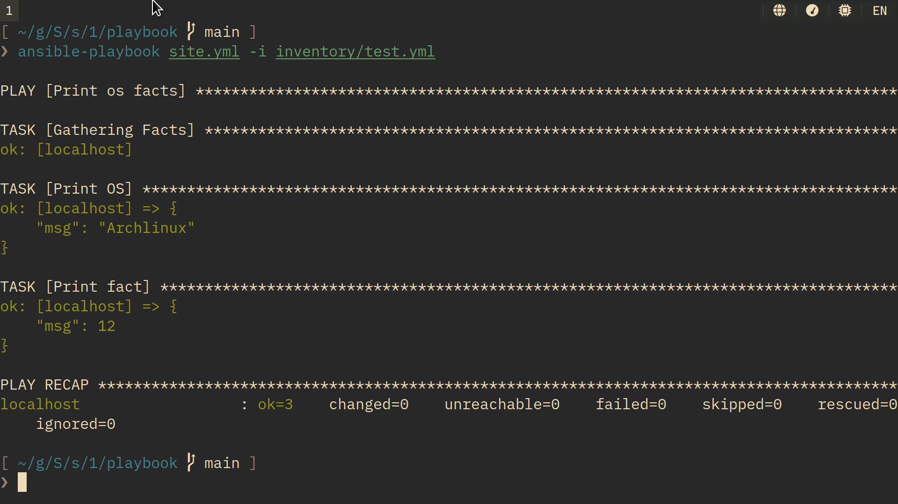
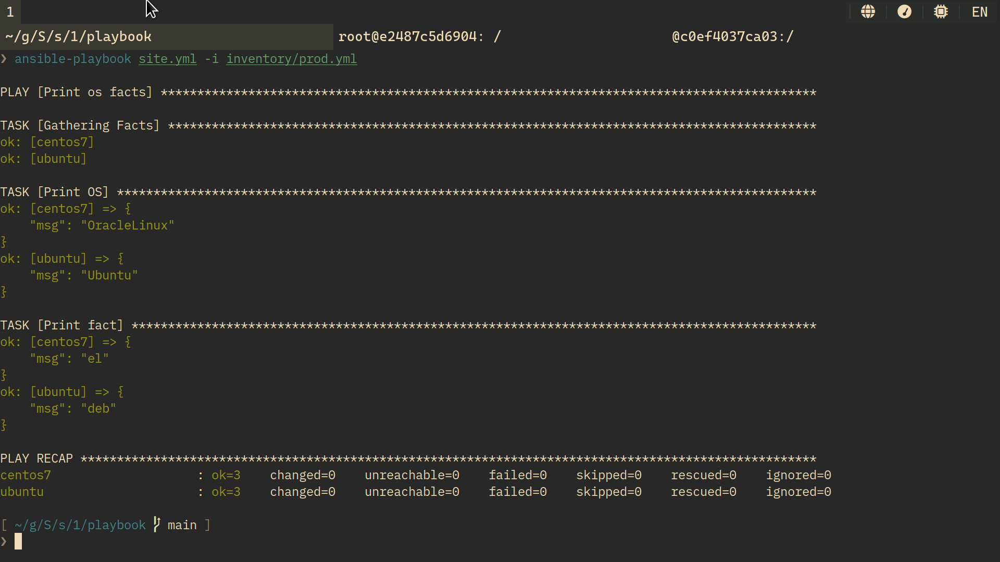
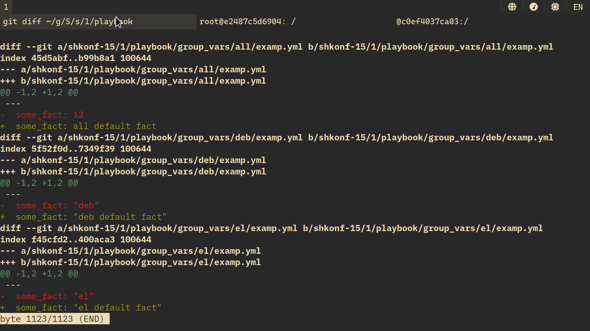
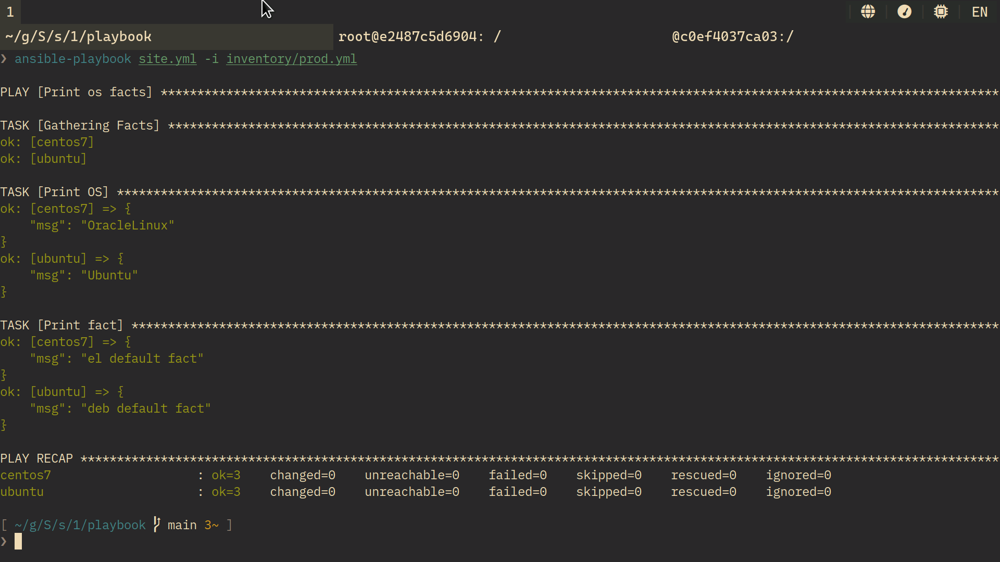
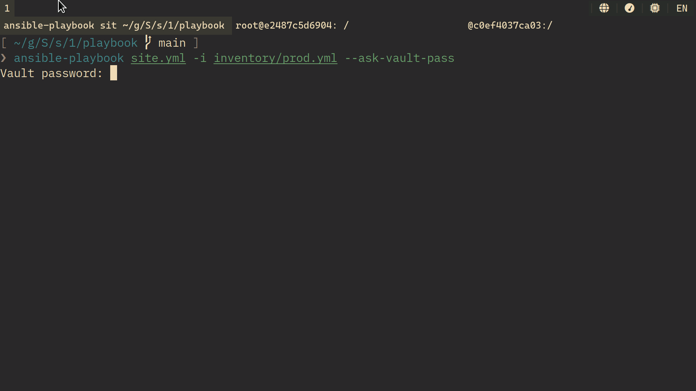
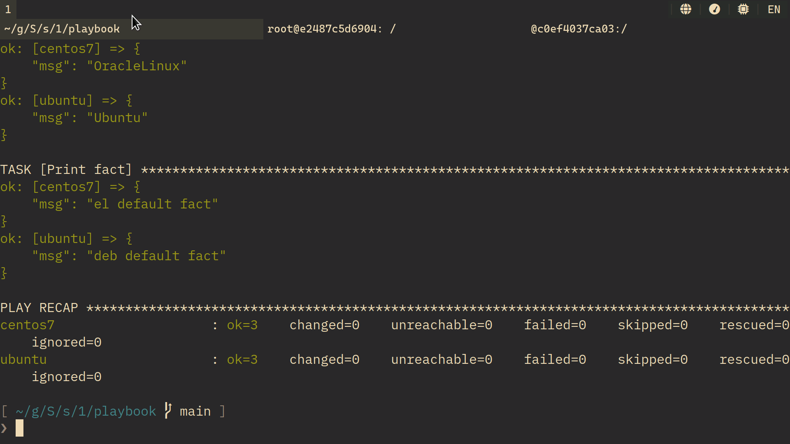
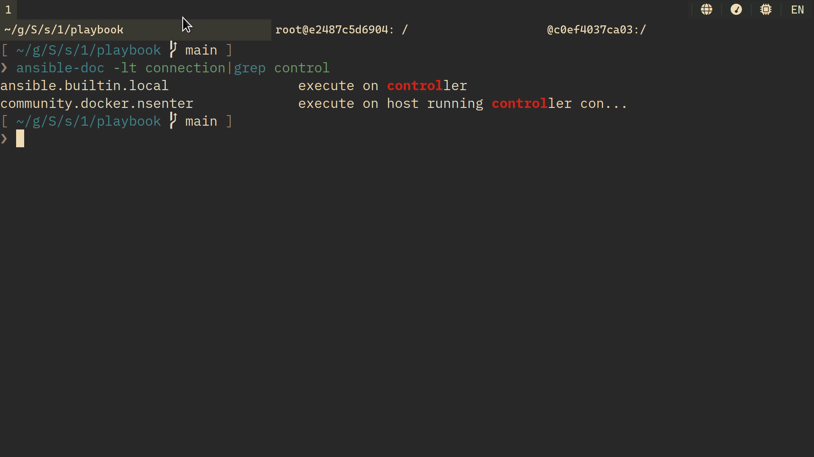
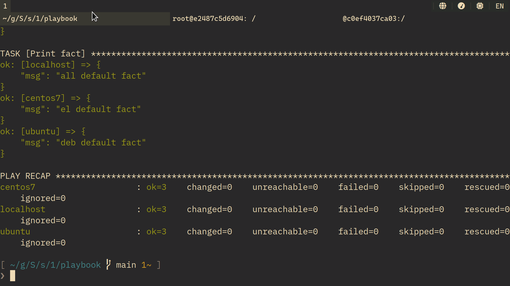

shkonf-15: 01
=============

Задание 1
---------

1. 

2. см. 4.

3. Использовал docker. Centos 7 безнадёжно протух, взял OracelLinux 9.

4. 

5. 

6. 

7. [commit](https://github.com/vdrandom/SHDEVOPS-15/commit/831614d4359d564039fb22633b730baa0f874be6)

8. 
   

9. 
   `ansible.builtin.local`

10. [commit](https://github.com/vdrandom/SHDEVOPS-15/commit/831614d4359d564039fb22633b730baa0f874be6)

11. 
