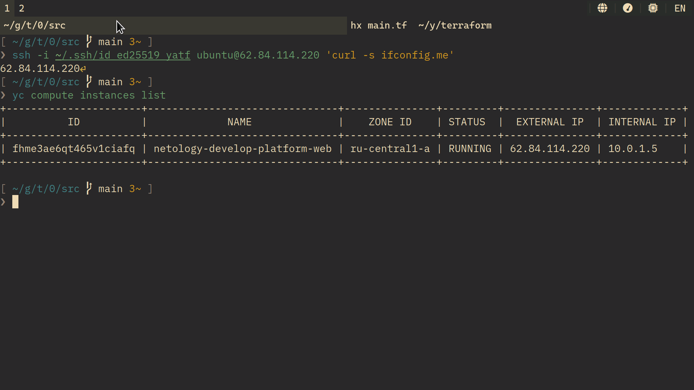
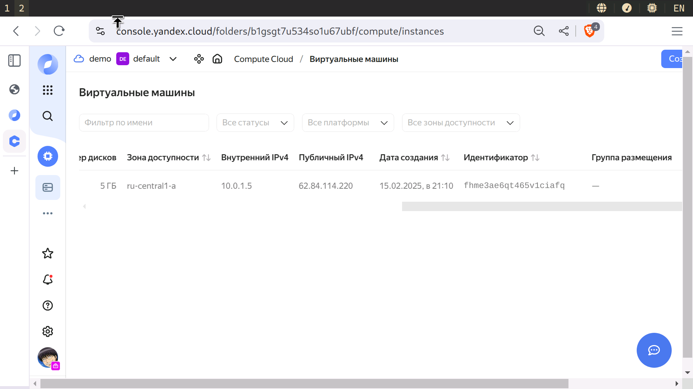

shter-15: 02
============

Задание 1
---------

4. [yandex_compute_instance.platform.platform_id](https://yandex.cloud/en/docs/compute/concepts/vm-platforms), [yandex_compute_instance.platform.resources](https://yandex.cloud/en/docs/compute/concepts/performance-levels): неверно задана платформа, неверно указаны ресурсы (количество ядер, возможно процент ядра)

6. [Так](https://yandex.cloud/en/docs/compute/concepts/performance-levels) [дешевле](https://yandex.cloud/en/docs/compute/concepts/preemptible-vm).
