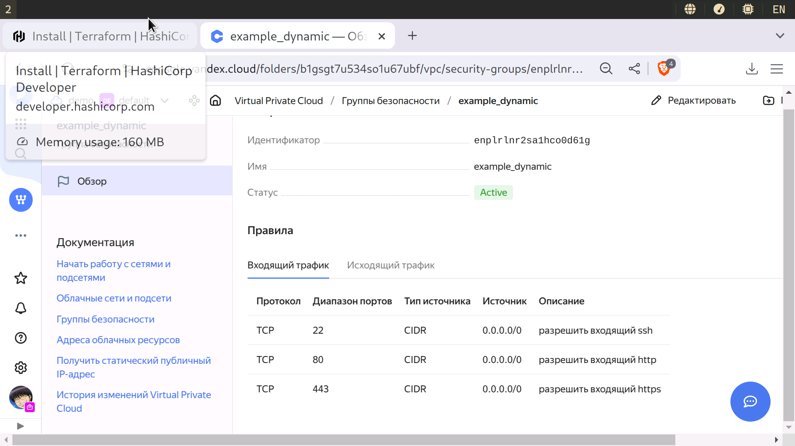

shter-15: 03
============

[Код](src/)

Задание 1
---------


Задание 4
---------
Непонятно, зачем тут скриншот, но приложил и [его](images/4-01.png)

```
[webservers]
web-1 ansible_host=89.169.152.219 fqdn=fhm4b5iofg6bcdacp6ia.auto.internal
web-2 ansible_host=51.250.5.174 fqdn=fhm0hesk4j7g209b5f7i.auto.internal

[databases]
main ansible_host=10.0.1.30 fqdn=fhmpu0ethd9htc4kck0v.auto.internal
replica ansible_host=10.0.1.26 fqdn=fhm34jg63k8c81tmr8rb.auto.internal

[storage]
storage ansible_host=10.0.1.21 fqdn=fhmjir9net6atgq843m3.auto.internal
```
