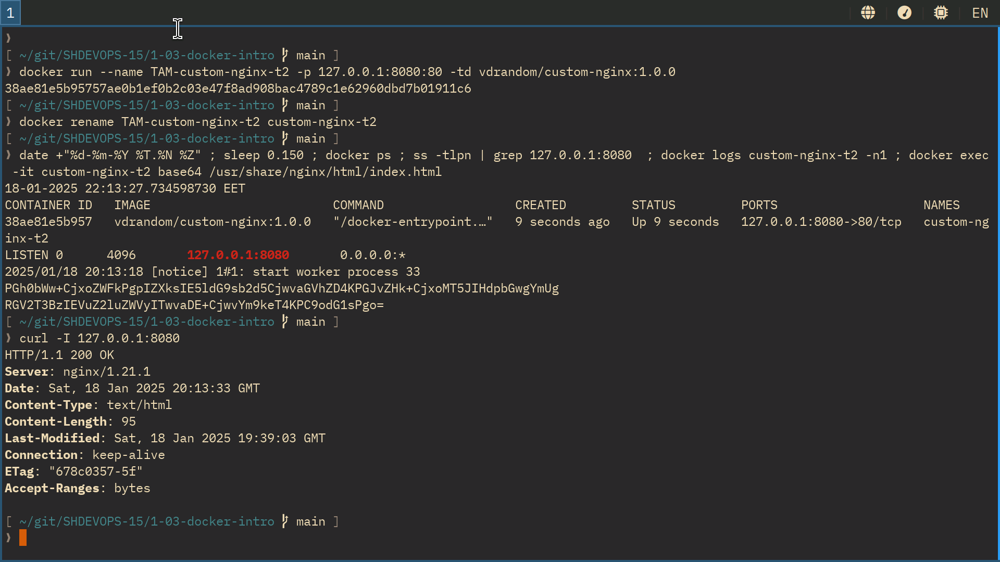
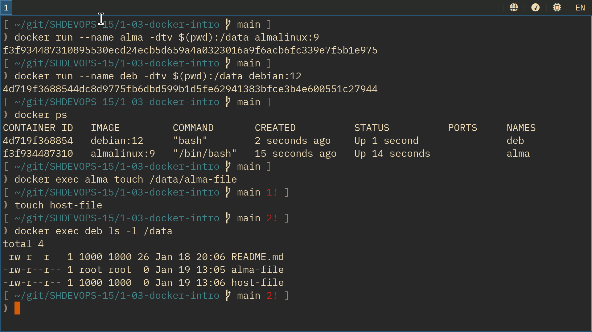
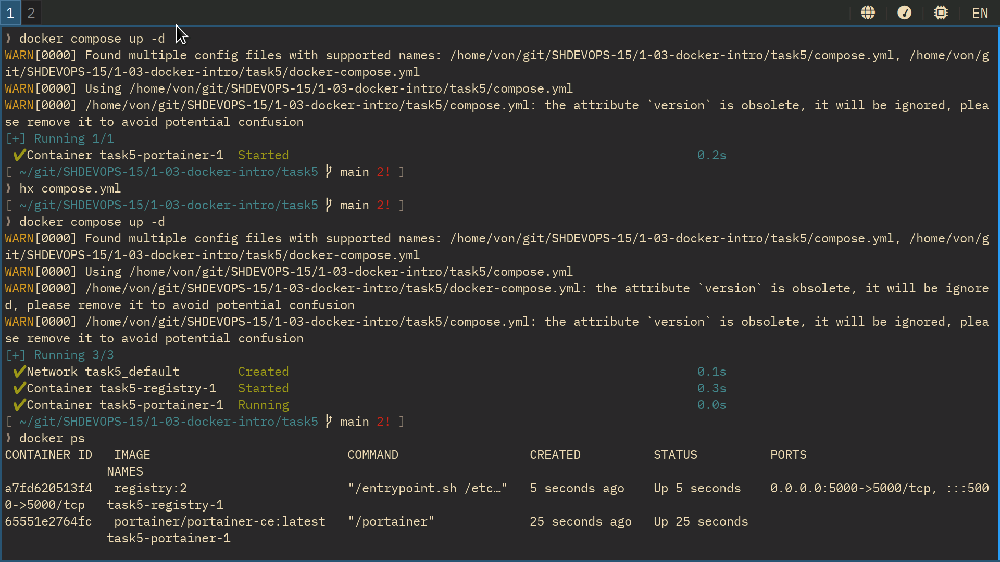

shvirtd-15: docker intro
========================

Задача 1
--------
[vdrandom/custom-nginx](https://hub.docker.com/r/vdrandom/custom-nginx)

Задача 2
--------


Задача 3
--------

Технически приложение должно было получить SIGINT из stdin и остановиться. Но судя по всему docker перехватывает этот сигнал и вместо этого просто отцепляет терминал. Возможно, задание устарело и что-то поменялось? Честно говоря, `docker attach` приходится использовать крайне редко.


Мы сменили конечный порт, докер об этом не в курсе. Пакеты по-прежнему форвардятся на 80/tcp, но там уже никто не слушает (connection reset by peer).

Почитал про перенастройку форвардинга в докере. Как хорошо, что этой наркоманией не приходится заниматься примерно никогда.

Задача 4
--------


Задача 5
--------



В предупреждении сказано, что в compose-файле больше нет одного из сервисов. Чтобы привести запущенные проекты в соответствие с конфигом можно одной командой остановить лишнее.

> В качестве ответа приложите скриншоты консоли, где видно все введенные команды и их вывод, файл compose.yaml , скриншот portainer c задеплоенным компоузом.

Непонятно, о каком именно состоянии  `compose.yaml` идёт речь в задании. Пусть будет с include:
```yaml
include:
  - docker-compose.yml
services:
  portainer:
    network_mode: host
    image: portainer/portainer-ce:latest
    volumes:
      - /var/run/docker.sock:/var/run/docker.sock
```
