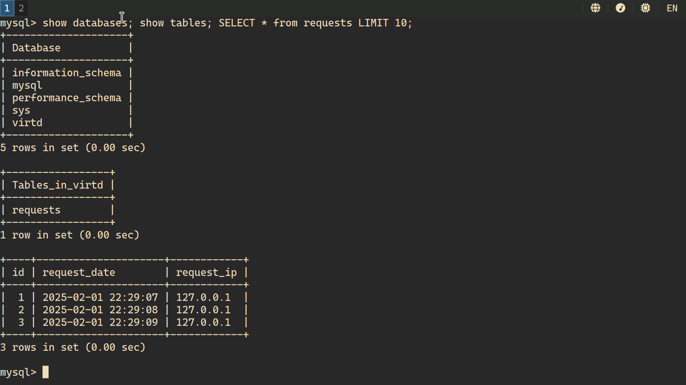
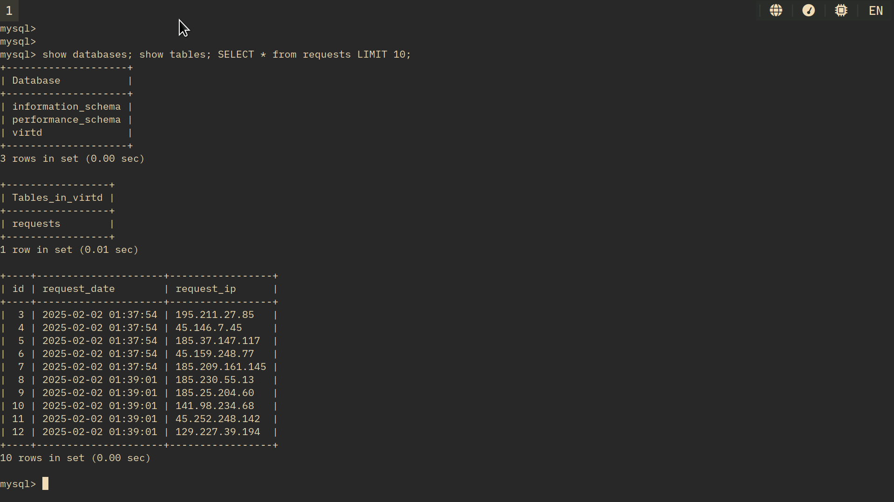
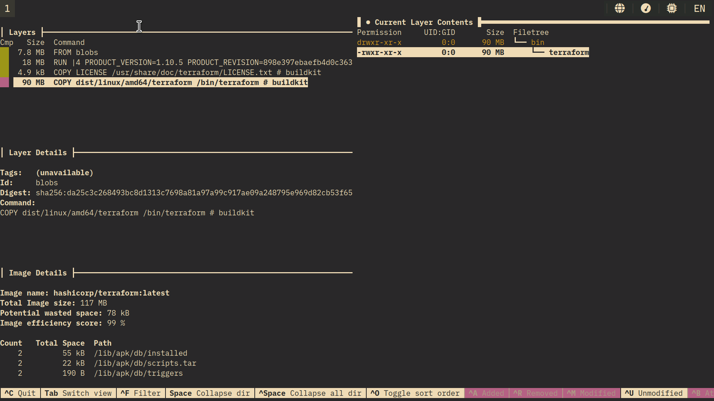
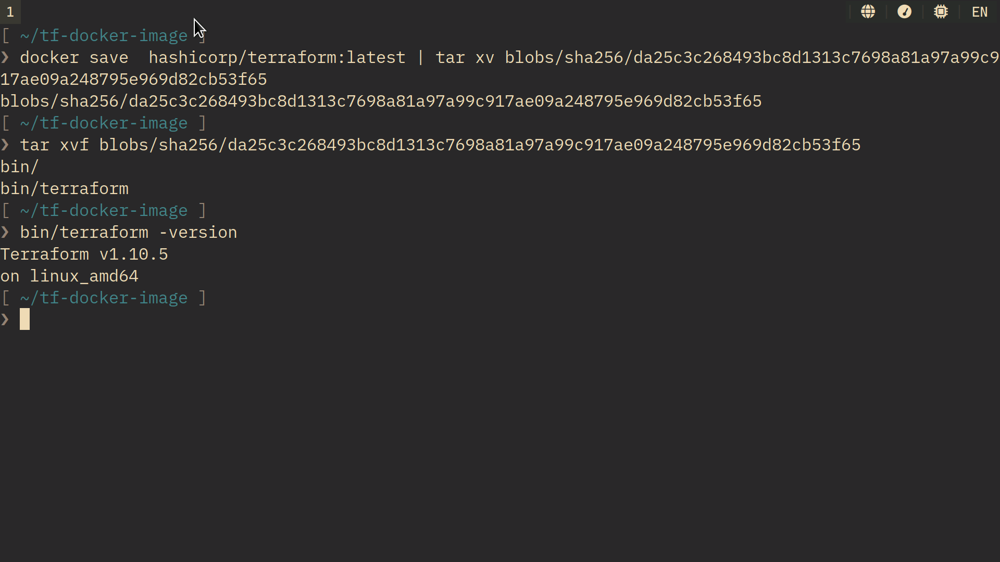
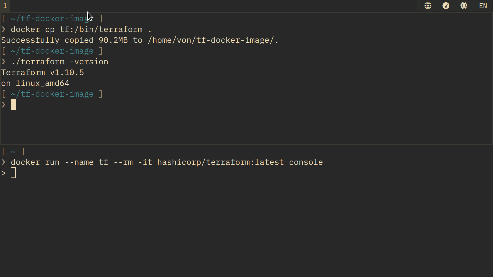

shvirtd-15: docker in practice
==============================

Задача 1
--------
* [Решение с использованием registry в yc](https://github.com/vdrandom/shvirtd-example-python)
* [Решение со сборкой и terraform+ansible](https://github.com/vdrandom/shvirtd-example-python/tree/solution)

Регистри в облаке был удалён. Думаю, хранить там образ большого смысла нет.

Задача 2
--------
[Отчёт сканирования образа](files/vulnerabilities.csv)

Задача 3
--------

Кстати, директива version в compose устарела.

Задача 4
--------

* [deploy (из registry)](https://github.com/vdrandom/shvirtd-example-python/blob/solution/deploy)
* [deploy (через build)](https://github.com/vdrandom/shvirtd-example-python/blob/solution/deploy)

Ссылки на репозиторий в [Задаче 1](#задача-1)

Задача 6
--------

